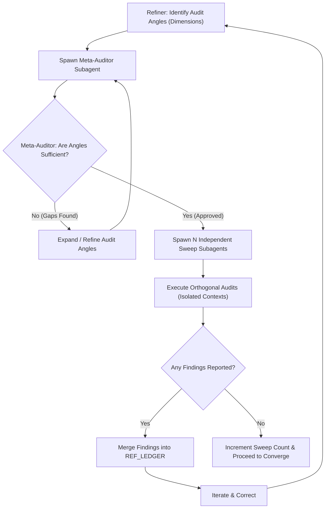

# ADR-002: Multi-Boundary Subagent Sweeps (MBSS) in Refinement Loops

**Status:** ACCEPTED

**Date:** 2026-06-09

---

## Context

Autoregressive Large Language Models (LLMs) executing trajectory optimization loops suffer from **prefix-induced attractor basin lock-in**. When the refiner agent executes the validation sweep of its own modifications, its history prefix ($\mathbf{S}_t$) contains its own internal reasoning, design iterations, and confirmations. This warps the token probability landscape, heavily bias-locking subsequent tokens into confirming its own work.

Additionally, static checklist sweeps or hardcoded persona audits (e.g., checking only security and basic edge cases) fail to cover the actual dimensionality of domain-specific changes. For instance, an audit of a user interface change requires a UI/UX aesthetics critique; a network protocol change requires a packet boundary and reliability critique. A fixed-personae loop is insufficient for the broad state spaces encountered in codebase mutations.

## Decision

We introduce **Multi-Boundary Subagent Sweeps (MBSS)** as the mandatory verification mechanism for the `/refine` workflow. 

The sweep phase of `/refine` is refactored into three sequential stages:

### 1. Dynamic Boundary Identification
Prior to entering the sweep verification, the refiner must identify the dimensions of the code state-space touched by the modifications. It drafts a list of **Adversarial Audit Angles** (e.g., security, edge cases, UX, performance, database safety) with specific verification rubrics for each.

### 2. Meta-Auditor Validation
To prevent the refiner from selecting weak or self-serving angles, it spawns an independent **Meta-Auditor subagent** with a clean context, passing the goal, the diff, and the proposed angles.
* **Role:** To analyze the structural diff and verify if the proposed audit angles exhaustively span the relevant state space.
* **Action:** The Meta-Auditor must identify any blind spots or missing dimensions and rewrite/sharpen the subagent prompts to ensure maximum critical intensity. It must approve the final sweep list before the refiner can proceed.

### 3. Isolated Orthogonal Auditing
For each approved angle, the refiner spawns a separate subagent initialized with an orthogonal **Initial Boundary Condition (IBC)** (a custom prompt and role blind to the refiner's internal trajectory).
* **Isolation Invariant:** Each subagent operates in its own isolated context window, seeing only the final code/diff and its specific prompt. It cannot see the refiner's internal thinking trace, other subagents' traces, or the sketchpad history. This preserves the purity of the token space walk for each critique.
* **Convergence Invariant:** The sweep is declared clean only when all N subagents report zero findings. Any finding forces a return to the `ITERATE` phase, clearing the consecutive sweep counter.

## Consequences

### Positive

- **Non-Delusional Convergence:** Breaks the attractor basin lock-in by utilizing isolated, unpolluted token spaces.
- **Exhaustive Coverage:** Scales dynamically to cover any domain (e.g., UX, database integrity, distributed consensus) rather than relying on a static checklist.
- **Skeptical Rigor:** Installs a peer-review system with an independent Meta-Auditor checking the completeness of the review plan.

### Negative

- **Increased Latency:** Spawning multiple concurrent subagents makes the sweep phase take longer to complete.
- **Increased Token Cost:** Running parallel, multi-step subagent validation cycles increases overall computational and API consumption.

---

## References

- Rules: [rules.md](../../rules.md)
- Refine Skill: [skills/refine/SKILL.md](../../skills/refine/SKILL.md)
