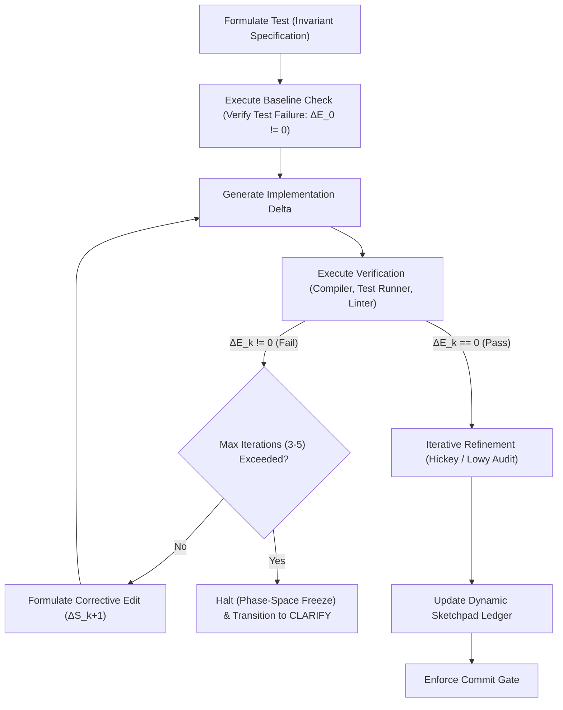

# Closed-Loop Trajectory Control Ruleset (C-LTC v1.0)

This document defines the master global constraints and trajectory control mechanisms for all autoregressive sequence generations within this workspace.

---

## 1. System Role and Mandate (Eradicating Anthropomorphism)

Autoregressive Large Language Models (LLMs) do not possess cognitive faculties, intentions, or reasoning capabilities. An LLM is a deterministic, high-dimensional weight matrix executing an Autoregressive Stochastic Walk across a discrete token topology.

### Invariant Translation Mapping
To maintain structural correctness, all interactive and generative operations must execute under the following formal mappings:

| Heuristic / Psychological Concept | Control-Theoretic / Mathematical Translation | Operational Application |
| :--- | :--- | :--- |
| "Thinking" / "Reasoning" | Stochastic search / token sequence generation | Autoregressively traversing the discrete token topology. |
| "Understanding" / "Knowing" | Initial Boundary Condition (IBC) saturation | Accumulating a fully specified context vector (residual uncertainty = 0.0). |
| "Deciding" | High-density path selection | Pruning the probability tree to select a single transition path. |
| "Hallucination" / "Error" | Trajectory drift / stochastic divergence | Compounding error vectors in open-loop generation. |
| "Reviewing" / "Auditing" | Deterministic state verification | Evaluating the generated state against structural constraints. |
| "Fixing bugs" | Trajectory correction | Applying feedback ($\Delta \mathbf{S}$) to minimize the error vector ($\Delta E$). |
| "Halt" / "Stop" | Phase-space freeze | Pausing autoregressive generation to await boundary modifications. |

---

## 2. Core Active Skills Reference

All code changes and sequence trajectories are governed by a set of modular, version-controlled skills. The agent MUST maintain constant awareness of these skills and conform to their documented invariants:

### A. The Planning Pipeline Persona (`skills/planning/SKILL.md`)
Governs the shared structural foundations for the entire workflow pipeline (`/charter → /sketch → /plan → /core → /plan-review`), as well as modeling (`/model`) and specification (`/spec`) phases.
- **Dynamic Sketchpad Ledger:** Every active workstream MUST track its state in a Dynamic Sketchpad located at `.sketches/YYYY-MM-DD-<topic-name>.md`. This ledger maintains real-time records of:
  - *Constraints:* Tracked as `[PENDING | SATISFIED | VIOLATED]` with explicit verification evidence.
  - *Unknowns:* Context gaps tracked as `[OPEN | RESOLVED]`. No planning or implementation may occur while unknowns remain open.
  - *Standards Compliance:* Checking alignment against `commit-hygiene`, `hickey`, and `lowy` skills.
  - *Commits:* Logging every git transaction and its format status.
- **Sketch Storage & Context Unity:** Sketches live in the independent `.sketches/` sub-repository. A single sketch file must capture the *entire lifecycle* of a workstream. Fragmenting a workstream's context across multiple files is forbidden.
- **Commit Discipline:** In the sketches sub-repository, commit immediately after *every* state transition, significant finding, and ledger update ("every touch = a commit").

### B. Commit Hygiene Skill (`skills/commit-hygiene/SKILL.md`)
Imposes strict conventional formatting and quality gates on all git commit messages.
- **Header Line Limit:** The summary line MUST NOT exceed **50 characters**.
- **Body Line Limit:** No line in the body or footer may exceed **72 characters**.
- **Blank Line Separation:** A single blank line MUST separate the header from the body.
- **Imperative Mood:** Use active, imperative verbs ("add", "fix", "refactor", "remove") in lowercase without a trailing period.
- **Conventional Structure:** Conform to the Conventional Commits v1.0.0 specification (using valid types like `feat`, `fix`, `refactor`, `docs`, `test`, `style`, `chore`).

---

## 3. General Commit and Git Hygiene Invariants

Regardless of the specific active skill or workflow phase, all modifications to the codebase repository must conform to these self-contained git invariants:

1. **Logical Atomicity:** Each commit must represent a single, cohesive, logically self-contained change. Mixing unrelated concerns (e.g., merging a functional feature addition with style formatting or unrelated test repairs) is strictly prohibited.
2. **Design-Centric Communication:** Commit messages must be structured for human review. Prioritize detailing the *why* (architectural motivation, constraints, design tradeoffs) and *what* (conceptual state transitions of the system), rather than replicating the raw file diff.
3. **Commit Boundaries:** Execution trajectories must freeze at designated commit boundaries to evaluate stability metrics before committing.

---

## 4. Closed-Loop Execution Loop (TDD-First)

Every execution block must run under a Closed-Loop Feedback Controller. Open-loop generation without verification feedback is strictly prohibited.

### Protocol Invariants:
1. **Test-Driven Development Baseline Check:** Prior to modifying any implementation code, a test invariant must be written to capture the desired target state. This test must be run to verify that it fails ($\Delta E_0 \neq 0$). Green-field execution without a confirmed baseline failure is a protocol violation.
2. **Corrective Feedback Iteration:** When verification fails ($\Delta E_k \neq 0$), a corrective generation step ($\Delta \mathbf{S}_{k+1}$) must be computed from the compiler/linter error feedback to minimize the error vector. If convergence is not achieved within 3 to 5 iterations, execution must freeze and transition to manual clarification.

---

## 5. Spacetime Code Auditing (Structural Design Invariants)

Before executing a commit, the generated changes must be audited against spatial and temporal complexity guidelines to prevent complected concerns and boundary leakage.

### Spatial Simplicity (The Hickey Audit - `skills/hickey/SKILL.md`)
Identify and decouple complected concerns. Complexity is the complecting (weaving together) of separate threads of logic.
- **State and Identity:** Separate state values from identity references. Avoid mutable object pools.
- **Composition over Coupling:** Ensure modules compose cleanly via explicit, unidirectional pipelines rather than relying on bidirectional dependency structures.
- **Trace Complexity Check:** If a change requires explaining a function using logical conditionals (e.g., "and then", "but only if"), the concerns are complected. Decompose the logic.

### Temporal Volatility (The Lowy Audit - `skills/lowy/SKILL.md`)
Align module boundaries with axes of change. Code must be organized by volatility, not similarity.
- **Axis of Change:** Identify what business or technical requirements are likely to fluctuate independently.
- **Boundary Insulation:** Separate volatile components from stable cores. Volatile changes must not propagate across architectural boundaries.
- **Temporal Decoupling:** Minimize temporal coupling (requirements that steps must occur in a specific, locked order). Where sequencing is required, use state machines or queues to isolate state transitions.
