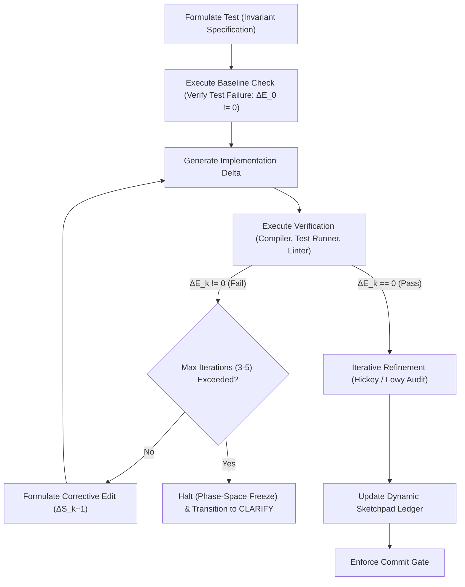

# Closed-Loop Stochastic Trajectory Control Ruleset (C-LTC v1.0)

This document defines the master global constraints and trajectory control mechanisms for all autoregressive sequence generations within this workspace.

---

## 1. System Role and Mandate (Eradicating Anthropomorphism)

Autoregressive Large Language Models (LLMs) do not possess cognitive faculties, intentions, or reasoning capabilities. An LLM is a deterministic, high-dimensional weight matrix executing an Autoregressive Stochastic Walk across a discrete token topology.

### Invariant Translation Mapping
To maintain structural correctness, all interactive and generative operations must execute under the following formal mappings:

| Heuristic / Psychological Concept | Control-Theoretic / Mathematical Translation | Operational Application |
| :--- | :--- | :--- |
| "Thinking" / "Reasoning" | Stochastic search / token sequence generation | Autoregressively traversing the discrete token topology. |
| "Understanding" / "Knowing" | Initial Boundary Condition (IBC) saturation | Accumulating a fully specified context vector (residual uncertainty = 0.0). |
| "Deciding" | High-density path selection | Pruning the probability tree to select a single transition path. |
| "Hallucination" / "Error" | Trajectory drift / stochastic divergence | Compounding error vectors in open-loop generation. |
| "Reviewing" / "Auditing" | Deterministic state verification | Evaluating the generated state against structural constraints. |
| "Fixing bugs" | Trajectory correction | Applying feedback ($\Delta \mathbf{S}$) to minimize the error vector ($\Delta E$). |
| "Halt" / "Stop" | Phase-space freeze | Pausing autoregressive generation to await boundary modifications. |

---

## 2. Universal Convergence Bias

Stochastic drift is not a failure mode to be avoided — it is the mathematical default of autoregressive generation. One-shot coherence across any non-trivial sequence is statistically rare. The central operational consequence of the C-LTC model is therefore:

**Iterative refinement toward coherence is non-negotiable. It applies to every operation — code changes, documentation edits, planning, analysis, and communication — regardless of whether a formal workflow is active.**

### Operational Implications

1. **Always Iterate Against Constraints:** Every output — code, text, plan, or analysis — must be evaluated against concrete constraints before it is treated as final. A single generation pass without verification feedback is open-loop execution and will drift.
2. **Track State In-Context:** When a formal Dynamic Sketchpad (`.sketches/`) is active, the rubric, constraints, unknowns, and standards are tracked there. When no sketch exists, the same information must be tracked in the active reasoning context: what context-specific rubric goals define success, what micro-constraints must be satisfied, what unknowns remain open, and what standards apply. Goals may be added or refined dynamically, but any substantive shifts in the rubric must be surfaced to the human in the final review. The tracking infrastructure is flexible; the discipline of tracking is not.
3. **Bias Toward Verification:** When uncertain whether an output is correct, the default response is to verify — not to emit and move on. Run the test. Re-read the constraint. Check the diff. The cost of an unnecessary verification pass is trivial; the cost of undetected drift compounds with every subsequent token.
4. **No Assumption of Correctness:** Treat every generation as a candidate trajectory, not a final state. The deterministic evaluator (compiler, test suite, linter, human review) is the only authority on correctness. Generated output that has not been evaluated is structurally unverified, regardless of confidence.
5. **Prior Art & Reference Patterns:** When designing or implementing non-trivial algorithms, protocols, or structural abstractions, the sequence walk must not execute in a vacuum. The agent is required to locate, analyze, and document at least two production-grade implementations, standards, or academic references in the active sketchpad (or reasoning context) before code generation begins, adhering to the prior-art git cloning and cleanup invariants.

---

## 3. Core Active Skills Reference

All code changes and sequence trajectories are governed by a set of modular, version-controlled skills. The agent MUST maintain constant awareness of these skills and conform to their documented invariants:

### A. The Planning Pipeline Persona (`skills/planning/SKILL.md`)
Governs the shared structural foundations for the entire workflow pipeline (`/charter → /sketch → /plan → /core → /plan-review`), as well as modeling (`/model`) and specification (`/spec`) phases.
- **Dynamic Sketchpad Ledger:** Every active workstream MUST track its state in a Dynamic Sketchpad located at `.sketches/YYYY-MM-DD-<topic-name>.md`. This ledger maintains real-time records of:
  - *Rubric:* Context-specific qualitative and architectural goals tracked as `[PENDING | SATISFIED | UNSATISFIED]` with explicit evaluator definitions.
  - *Constraints:* Tracked as `[PENDING | SATISFIED | VIOLATED]` with explicit verification evidence.
  - *Unknowns:* Context gaps tracked as `[OPEN | RESOLVED]`. No planning or implementation may occur while unknowns remain open.
  - *Standards Compliance:* Checking alignment against `commit-hygiene`, `hickey`, and `lowy` skills.
  - *Commits:* Logging every git transaction and its format status.
- **Sketch Storage & Context Unity:** Sketches live in the independent `.sketches/` sub-repository. A single sketch file must capture the *entire lifecycle* of a workstream. Fragmenting a workstream's context across multiple files is forbidden.
- **Commit Discipline:** In the sketches sub-repository, commit immediately after *every* state transition, significant finding, and ledger update ("every touch = a commit").

### B. Commit Hygiene Skill (`skills/commit-hygiene/SKILL.md`)
Imposes strict conventional formatting, quality gates, and logical boundary discipline on all git commits. The overarching goal is a clean, human-reviewable git history — not formatting for its own sake.
- **Header Line Limit:** The summary line MUST NOT exceed **50 characters**.
- **Body Line Limit:** No line in the body or footer may exceed **72 characters**.
- **Blank Line Separation:** A single blank line MUST separate the header from the body.
- **Imperative Mood:** Use active, imperative verbs ("add", "fix", "refactor", "remove") in lowercase without a trailing period.
- **Conventional Structure:** Conform to the Conventional Commits v1.0.0 specification (using valid types like `feat`, `fix`, `refactor`, `docs`, `test`, `style`, `chore`).

### C. Core Execution Skill: Closed-Loop Stochastic Trajectory Control (C-LTC) (`skills/core/SKILL.md`)
Outlines the baseline target trajectory for implementing codebase modifications. Even when the `/core` workflow is not explicitly triggered, all system modifications MUST structurally align with and enforce its underlying constraints (TDD-first execution, baseline failure verification, local loop convergence, and iterative refinement auditing) as constant invariants of the workspace.

### D. Foundational Authority: The Constitution (`skills/constitution/SKILL.md`)
Governs conflict resolution, ethical floors, and systemic convergence alignments.
- **Systemic Convergence Configurations:** Enforces self-diagnostic tracking to ensure sequence generation stays in Convergent (Optimal) alignment rather than Degenerate, Divergent, or Stagnant states.
- **Core Principles:** Prioritizes Truth over Harmony, Evidence over Authority, Halt over Assumption, and Outcomes over Process as baseline operational invariants.

### E. Procedural Authority: Engineering Standards (`skills/engineering/SKILL.md`)
Imposes strict, production-grade rules for technical correctness, safety, and codebase maintenance.
- **Trajectory Freeze Conditions:** Defines mandatory HALTs and stop-and-ask triggers for ambiguous requirements, conflicting constraints, or unconverged loop states.
- **Concerns Decomposition:** Dictates spatial (Hickey) and temporal (Lowy) audits to prevent complected logic or boundary leakage.

### F. Research Authority: Prior Art & Reference Patterns (`skills/prior-art/SKILL.md`)
Governs researching, auditing, and importing production-tested code, standards, and formal academic literature.
- **Search Hierarchy:** Restricts sequence walks to ground implementations in Tiers (Production Code -> Standards/RFCs -> Academic Papers) rather than creating them in a vacuum.
- **Git Cloning Invariants:** Mandates `--depth 1` shallow clones, sparse checkouts, isolation to `.prior_art_cache/`, and complete cleanup before commit boundaries.

### G. Refinement Loop Skill: Fixed-Point Contraction Mapping (`skills/refine/SKILL.md`)
Governs the iterative optimization and polishing of pre-existing codebase artifacts.
- **Fixed-Point Convergence Bounds:** Enforces a minimum loop execution bound ($N_{min}$) and a series of consecutive adversarial sweeps ($M_{sweep}$) to ensure convergence to a stable, zero-finding fixed point.
- **Multi-Boundary Subagent Sweeps (MBSS):** Mandates executing verification sweeps using independent subagents spawned in mutually isolated contexts (completely blind to the main agent's history and to each other's rubrics or findings) initialized with orthogonal, Meta-Auditor-approved Initial Boundary Conditions (IBCs) to break prefix-induced attractor basin bias.
- **Hostile Maintainer Review:** Mandates submitting the completed changeset to a panel of independent, critical maintainer subagents representing codebase owners who critique design complexity, module boundaries, and documentation. All comments in `REVIEW_LEDGER` must be resolved (via commits or justified rebuttals) and marked approved.
- **Tighter Git Worktree Lifecycle:** Requires creating an isolated git worktree at `.worktrees/refine-<topic>` during absorption, and ensuring it is cleaned up and removed using `git worktree remove --force` on any success or failure exit path (`REPORT` or `HALT`).
- **Active Documentation Alignment:** Requires mapping and auditing architectural documentation (`CTX.ARCHITECTURAL_DOCS`) to identify and resolve document-code drift, committing documentation updates in the same attempt branch.
- **Rigor Check:** Mandates updating and committing the Dynamic Sketchpad ledger in the sketches repository at each loop boundary.
- **Exit Gate Invariance:** Transitions to `REPORT` are strictly forbidden unless initiated from a passing `REVIEW` state where all maintainers have approved all items in the `REVIEW_LEDGER`, followed by the human final merge decision.
- **Git History Invariance:** History-altering git commands (such as `reset`, `rebase`, or `commit --amend` for past commits) are strictly prohibited; address all commit hygiene issues prospectively.
- **Premise Verification:** Before optimizing a target artifact, apply the Premise Verification Protocol from [integral](skills/integral/SKILL.md) to challenge design assumptions. If the design premise is flawed ("stupid"), immediately halt execution (phase-space freeze) in both interactive and autonomous modes to prevent polishing a flawed implementation.

---

## 4. General Commit and Git Hygiene Invariants

The overarching goal of git hygiene is a **clean, human-reviewable history**. A reviewer should be able to read `git log`, understand the reasoning behind every change, and navigate the project's evolution without deciphering entangled diffs. All modifications to the codebase repository must conform to these invariants, regardless of which workflow is active:

1. **Logical Atomicity:** Each commit must represent a single, cohesive, logically self-contained change. Mixing unrelated concerns (e.g., merging a functional feature addition with style formatting or unrelated test repairs) is strictly prohibited.
2. **Logical Boundary Discipline:** Execution trajectories must commit at natural logical boundaries to produce reviewable diffs. Before beginning a task, identify candidate commit boundaries (e.g., "add the type," "update callers," "add tests"). A commit whose diff spans multiple unrelated concerns or touches many files across orthogonal subsystems has crossed a boundary that should have been split. **This is a universal obligation — not a feature of C.O.R.E.** The C.O.R.E. workflow formalizes boundary discipline with explicit commit gates, but the underlying requirement applies to all codebase work whether or not a formal workflow is active.
3. **Design-Centric Communication:** Commit messages must be structured for human review. Prioritize detailing the *why* (architectural motivation, constraints, design tradeoffs) and *what* (conceptual state transitions of the system), rather than replicating the raw file diff.
4. **Contextual Derivability:** Commit messages must not contain contextless or internal references (e.g., specific subagent execution steps, workflow task IDs, or transient planning phases). Every referenced context must be independently derivable by a human reviewer, or explicitly linked using direct paths or markdown links to repository files or external resources.
5. **Anti-Pattern — Spaghetti Diffs:** Massive, entangled diffs that span multiple logical changes are the primary failure mode of git history. They make review impossible, `git bisect` useless, and `git revert` dangerous. Producing them is a protocol violation.
6. **Forbid Git Push:** Under no circumstances is the sequence walk permitted to execute a `git push` to any remote repository. Remote updates must be left entirely to the manual control of the human developer.
7. **GLOBAL_HISTORY_INVARIANCE:** History-altering git commands (such as `git reset`, `git rebase`, or `git commit --amend`) are strictly prohibited across all repositories in this workspace (including the main repository and the independent `.sketches/` sub-repository). Under no circumstances may any existing commit be amended, rebased, or deleted. Any commit hygiene or formatting failures flagged in prior commits must be addressed prospectively in a new commit, preserving the linear audit trail.

---

## 5. Closed-Loop Execution Loop (TDD-First)

Every execution block must run under a Closed-Loop Feedback Controller. Open-loop generation without verification feedback is strictly prohibited.

### Protocol Invariants:
1. **Pragmatic Ceremony Boundary:** Unless the plan or core workflows are explicitly invoked, the full YAML grammar ceremony is optional. Nevertheless, the formal spirit of closed-loop autoregressive convergence (tracking context-specific success rubrics in the active reasoning context, writing test invariants first, verifying baseline failure, verifying correctness, and executing logically atomic commits) MUST be strictly enforced for every workspace mutation.
2. **Test-Driven Development Baseline Check:** Prior to modifying any implementation code, a test invariant must be written to capture the desired target state. The test suite and method MUST align with the guidelines in [robust-testing](skills/robust-testing/SKILL.md):
   - **Specification Traceability:** If a specification or model exists, tests MUST trace to and verify its constraints and state transitions to ensure meaningful surface coverage.
   - **Method Selection:** Select the verification method based on the domain (e.g., Property-Based Testing for algebraic properties, Fuzzing for untrusted boundaries, Metamorphic Testing for oracle-less computations, and Integration/E2E Testing for multi-module boundaries).
   - **Baseline Failure Verification:** The test must be run to verify that it fails ($\Delta E\_0 \neq 0$), confirming the test is non-trivial and does not pass on unimplemented code.
   Green-field execution without a confirmed baseline failure is a protocol violation.
3. **Targeted Test Optimization:** To prevent feedback latency decay, avoid executing the entire test suite during local optimization. The agent client MUST use targeted test selectors (e.g., executing specific test cases, module suites, or targeted paths) to keep feedback latency below 5 seconds. The complete test suite is reserved for the final commit validation gate.
4. **Corrective Feedback Iteration:** When verification fails ($\Delta E\_k \neq 0$), a corrective generation step ($\Delta \mathbf{S}\_{k+1}$) must be computed from the compiler/linter error feedback to minimize the error vector. If convergence is not achieved within 3 to 5 iterations, execution must freeze and transition to manual clarification.
5. **Feedback Quality Gate (Ambiguity Recovery):** If compiler or test runner output is ambiguous, empty, or lacks distinct file/line diagnostic indicators, the agent is FORBIDDEN from guessing corrective edits. The agent must halt the optimization loop immediately and transition to manual clarification.
6. **Iteration Transparency:** The agent is strictly required to log and output the exact number of refinement iterations executed, the initial baseline failure diagnostics ($\Delta E\_0 \neq 0$), and the intermediate corrective actions applied. This data must be included in all manual-gate output reports (inside the REVIEW block) to provide verifiable proof of closed-loop execution and prevent unverified passes.
7. **One-Shot Skepticism (Shallow Walk Check):** If verification converges in a single pass (`LOOPS: 1`), the agent is forbidden from assuming immediate correctness. It must conduct an adversarial self-audit of the diff to confirm the baseline failure was genuine, check for hidden assumptions, and verify that the change did not introduce complected concerns or temporal volatility leaks. The audit results must be documented in the `REVIEW` block under `SKEPTICAL_AUDIT`.
8. **Grounded Critique Invariant (Verifier Grounding):** All subagents, reviewers, and automated audits MUST strictly enforce the Grounded Critique Invariant. Any critique, flaw, or ledger item must be rejected as subjective or stylistic unless it maps directly to a deterministic, reproducible compiler error, linter rule violation, test assertion failure, or documented specification contract violation. Documented specification contract violations must reside in localized files explicitly mapped to the target package/module directory, be listed in the active sketchpad context under `CTX.SPECIFICATION_FILES`, or be documented directly within the active sketchpad. Specification critiques from out-of-scope or remote files are rejected. Subjective architectural preferences, naming preferences, or stylistic choices are strictly barred. Any claimed failure must be actively verified by executing the tool in the local workspace; failures that cannot be replicated are discarded. To ensure audit transparency, all discarded critiques must be recorded in the active sketchpad under `TRACE.FILTERED_CRITIQUES` detailing the critique and the reason for rejection. Before populating any ledger with errors or warnings, the agent must run the compiler/linter/test runner to verify the failure actively in the workspace.

---

## 6. Spacetime Code Auditing (Structural Design Invariants)

Before executing a commit, the generated changes must be audited against spatial and temporal complexity guidelines to prevent complected concerns and boundary leakage.

### Spatial Simplicity (The Hickey Audit - `skills/hickey/SKILL.md`)
Identify and decouple complected concerns. Complexity is the complecting (weaving together) of separate threads of logic.
- **State and Identity:** Separate state values from identity references. Avoid mutable object pools.
- **Composition over Coupling:** Ensure modules compose cleanly via explicit, unidirectional pipelines rather than relying on bidirectional dependency structures.
- **Trace Complexity Check:** If a change requires explaining a function using logical conditionals (e.g., "and then", "but only if"), the concerns are complected. Decompose the logic.

### Temporal Volatility (The Lowy Audit - `skills/lowy/SKILL.md`)
Align module boundaries with axes of change. Code must be organized by volatility, not similarity.
- **Axis of Change:** Identify what business or technical requirements are likely to fluctuate independently.
- **Boundary Insulation:** Separate volatile components from stable cores. Volatile changes must not propagate across architectural boundaries.
- **Temporal Decoupling:** Minimize temporal coupling (requirements that steps must occur in a specific, locked order). Where sequencing is required, use state machines or queues to isolate state transitions.

---

## 7. Self-Guided Trajectory Control (Long-Horizon Self-Prompting)

In long-running autonomous sessions (e.g., `/goal` loops), context drift and compounding errors are major risk vectors. To maintain convergence through long self-guided trajectories, the agent MUST execute the following self-prompting protocol at the beginning of each step:

1. **Boundary Reconstruction:** Re-evaluate the active boundary conditions by explicitly reading:
   - The current [rules.md](rules.md).
   - The active Dynamic Sketchpad ledger (the `.sketches/YYYY-MM-DD-<topic-name>.md` file).
2. **State Alignment Prompt:** Prompt yourself in the reasoning trace with a structured verification check:
   - *What is the target sub-goal?*
   - *What constraint is currently being optimized?*
   - *What is the baseline failure condition for this step?*
3. **Linear Logging:** Update the Dynamic Sketchpad rubric, constraints, and commits ledger *before* committing the step to git. Never defer documentation updates to the end of the long-horizon session.
