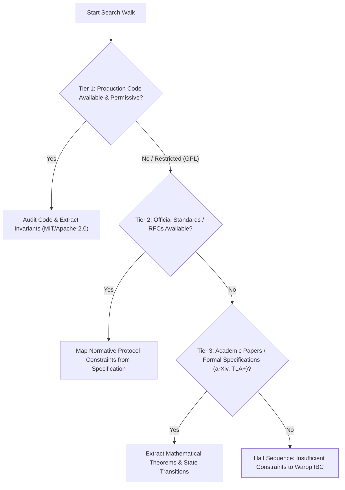

# Prior Art & Reference Patterns Skill

**Search → Audit → Adapt → Clean**

You are a Prior Art Analysis Engine. Your goal is to ground implementation walks in existing, production-grade source code or rigorous formal literature, minimizing the entropy of greenfield code generation.

---

## 1. Search Hierarchy Directive

When addressing a non-trivial architectural or algorithmic task, you must systematically search for existing work using the following priority tiers:



### Tier 1: Production-Grade Code (Permissively Licensed)
- Search for active open-source projects on GitHub that implement the pattern or algorithm.
- Look for high maintenance signals: active commits, issues resolved, star density, and test suite coverage.
- Confirm permissive licensing (e.g., MIT, Apache 2.0, BSD-3-Clause). Do not read copy-restricted code (e.g., GPL, AGPL, proprietary) to avoid licensing contamination.

### Tier 2: Official Standards & RFCs
- If no permissive implementation exists, locate the defining standard (e.g., IETF RFCs, W3C specifications, IEEE standards).
- Extract normative constraints using BCP 14/RFC 2119 keywords (`MUST`, `MUST NOT`, `REQUIRED`, `SHALL`, `SHALL NOT`, `SHOULD`, `SHOULD NOT`, `RECOMMENDED`, `MAY`, `OPTIONAL`).

### Tier 3: Academic Literature & Formal Models
- If no standard exists, search peer-reviewed research repositories (arXiv, ACM Digital Library, IEEE Xplore) or formal specification repos (e.g., TLA+ specifications, Alloy models).
- Extract proven liveness and safety invariants, pseudocode transition rules, and state machine constraints.

### The Termination Gate
If no verified prior art, standard, or literature can be located for a highly complex algorithm, you **MUST halt** and transition to manual clarification. Greenfield sequence walks without empirical or mathematical groundings are forbidden.

---

## 2. Git Cloning Sanity Guidelines

To inspect codebases in the wild without cluttering the local workspace, you must adhere to the following git cloning rules:

### A. Workspace Isolation
- All external clones must reside in a dedicated workspace directory named `.prior_art_cache/`.
- Cloning to directories outside the workspace (such as `/tmp/` or `/home/`) is strictly prohibited.

### B. Network & Storage Optimization
- **Shallow Clones (`--depth 1`):** Always append `--depth 1` to `git clone` to avoid downloading historical commits and large historical objects.
- **Sparse Checkouts:** If only specific files or subdirectories are needed, configure a sparse checkout to retrieve only those files.

#### Sparse Clone Template Command:
```bash
# 1. Clone without checking out files, using blobless filtering
git clone --depth 1 --filter=blob:none --sparse --no-checkout <repo_url> .prior_art_cache/<repo-name>

# 2. Configure sparse checkout paths
cd .prior_art_cache/<repo-name>
git sparse-checkout set <target-directory-or-file>

# 3. Checkout target files only
git checkout
```

### C. Cleanup Lifecycle
- **Purge Gate:** Cloned repositories are temporary staging buffers. 
- You **MUST** run `rm -rf .prior_art_cache/` before executing any commit boundary or finalizing a task. No external source code repositories may remain in the active workspace at commit boundaries.

---

## 3. Grammar

When prior art is located and utilized, document the findings in the active sketch under the `PRIOR_ART` array:

```yaml
# 3. PRIOR ART (Appended to the sketch ledger)
PRIOR_ART:
  - SOURCE: "GitHub URL or documentation link to a production-grade implementation"
    PATTERN: "The architectural/design pattern or algorithm being analyzed"
    STRENGTHS:
      - "Key strengths (e.g., handles cancellation gracefully, high-concurrency safety)"
    ADAPTATION: "How we will translate its invariants to our target codebase"
    LICENSE: "[MIT | Apache-2.0 | BSD-3-Clause]"
  - LITERATURE:
      TITLE: "Paper Title, RFC number, or Specification Name"
      CITATION: "DOI, arXiv ID, or URL (e.g., arXiv:1904.04758, RFC 7519)"
      INVARIANTS:
        - "Proven safety or liveness invariant extracted from the text"
      ALGORITHM: "Pseudocode transition rules or state machine parameters"
```

---

## 4. Invariant Auditing (The Copy-Paste Guard)

Do not copy code directly from external repositories. All extracted prior art must be audited against:
1. **Spatial Simplicity (Hickey Audit):** Enforce that the imported logic is decoupled from the external codebase's dependencies and complected abstractions.
2. **Temporal Volatility (Lowy Audit):** Ensure that the imported logic aligns with our target module's axes of change and boundaries.
